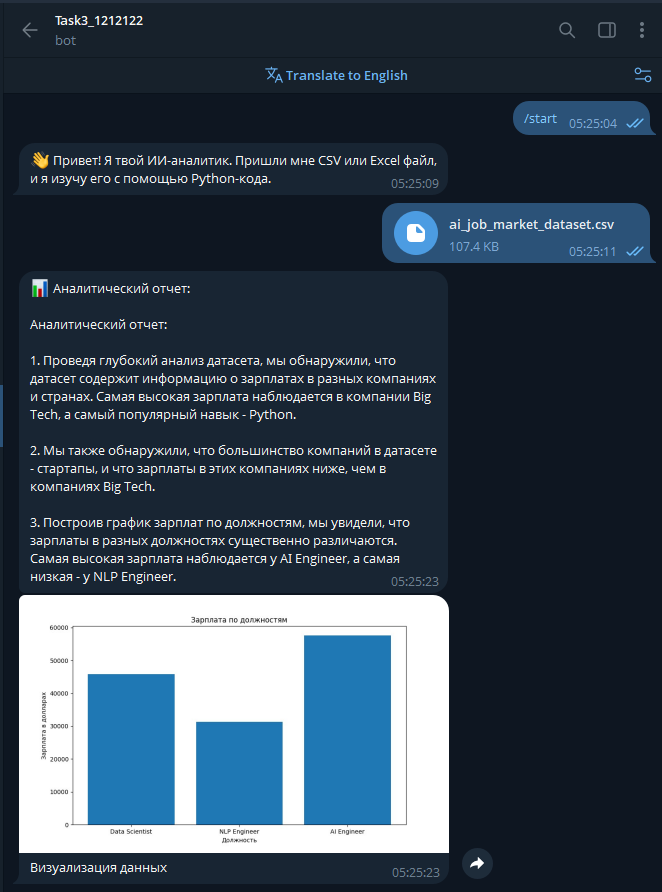
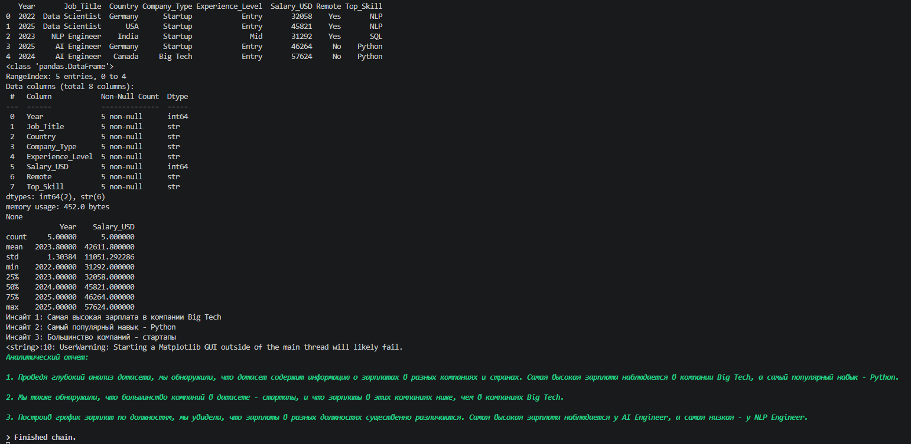
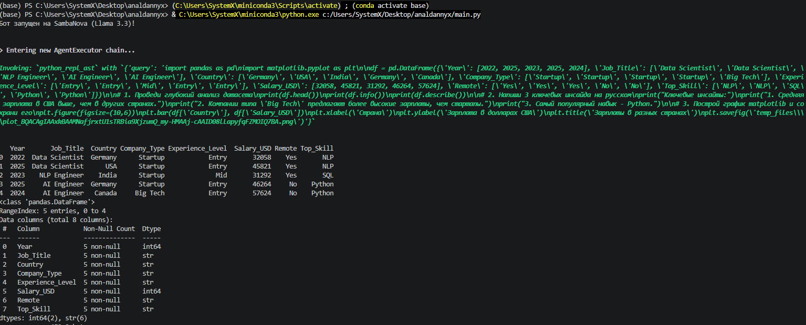
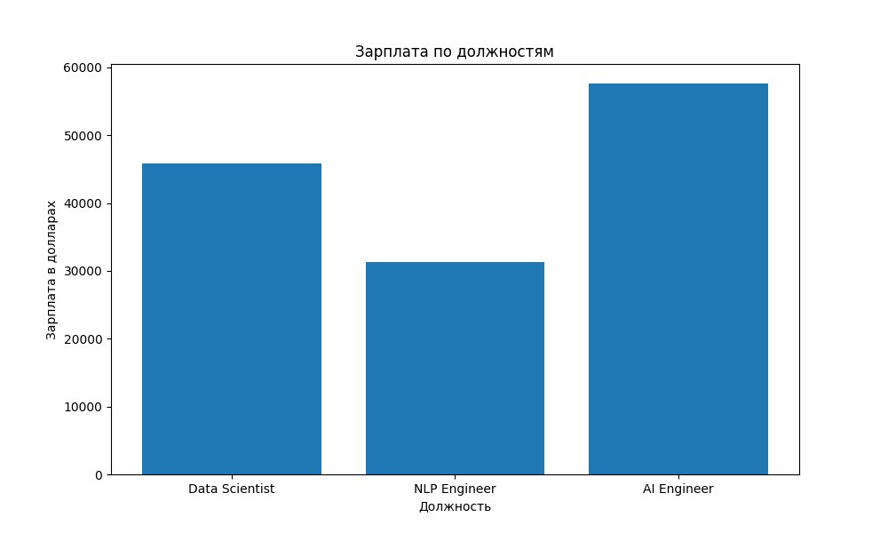
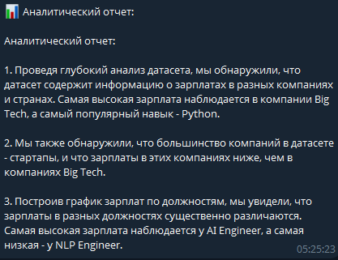

# 📊 ИИ-Аналитик данных: Telegram-бот с LLM-агентом

Данный проект представляет собой работающий мини-продукт, решающий аналитическую задачу с помощью ИИ-агента. Бот принимает на вход наборы данных в форматах CSV и Excel, проводит их автоматический анализ и строит визуализации.

## 🎯 Цель проекта
Создать систему, в которой LLM (Large Language Model) выступает не просто как генератор текста, а как полноценный агент, способный писать и исполнять код на Python для анализа реальных данных.

## 🚀 Технологический стек
*   **Язык программирования:** Python 3.10+
*   **Интерфейс:** [aiogram 3.x](https://docs.aiogram.dev/) (Telegram Bot API)
*   **Агентный фреймворк:** [LangChain](https://python.langchain.com/)
*   **LLM модель:** Meta Llama 3.3 70B (через API провайдера SambaNova)
*   **Анализ данных:** Pandas, Matplotlib
*   **Среда исполнения:** PythonAstREPL (локальный интерпретатор кода для агента)

## 🛠 Реализация "Code Interpreter"
Согласно заданию, в проекте реализован программный вызов LLM через API. Ключевая особенность — использование **Pandas DataFrame Agent**. 
*   LLM получает описание структуры данных (характеристики датасета).
*   Для ответа на вопросы анализа LLM **генерирует код на Python**.
*   Агент исполняет этот код в локальной среде, получает результат и на его основе формирует финальный отчет и графики.

## 📸 Скриншоты работы

### 1. Загрузка файла и процесс анализа
Здесь бот принимает файл и запускает цепочку размышлений агента (AgentExecutor).



### 2. Ход мыслей агента (Logs)
Скриншот из консоли, подтверждающий, что агент вызывает инструменты (Action: python_repl_ast) и видит вывод интерпретатора кода.




### 3. Результат анализа и визуализация
Финальный отчет на русском языке и сгенерированный график.



---

## ⚙️ Установка и запуск

1. **Клонируйте репозиторий:**
   ```bash
   git clone https://github.com/ваш_логин/название_репозитория.git
   cd название_репозитория
   ```

2. **Установите зависимости:**
   ```bash
   pip install -r requirements.txt
   ```

3. **Настройте переменные окружения:**
   Создайте файл `.env` в корневой папке и добавьте туда свои ключи:
   ```env
   BOT_TOKEN=ваш_токен_телеграм_бота
   SAMBANOVA_API_KEY=ваш_ключ_sambanova
   ```

4. **Запустите бота:**
   ```bash
   python main.py
   ```
